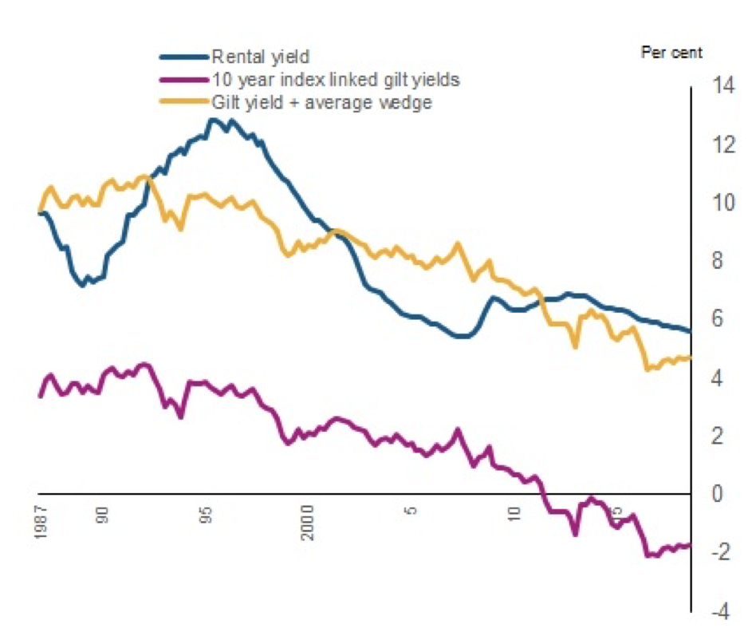

```{r setup, include=FALSE}
knitr::opts_chunk$set(echo = FALSE)

library(tidyverse)
library(lubridate)
library(readxl)
library(plotly)

#download.file('https://www.rbnz.govt.nz/-/media/ReserveBank/Files/Publications/Financial%20stability%20reports/fsr-13may15-data.xlsx?revision=7067fcba-4cd2-4c50-b529-3aced0b808e5', destfile = 'data/rbnz_rental_yields.xlsx')
#download.file('https://www.rbnz.govt.nz/-/media/ReserveBank/Files/Statistics/tables/b2/hb2-monthly.xlsx?revision=818f58fc-a7e1-4fd4-aea6-0d696a98d22b', destfile = 'data/rbnz_wholesale_rates.xlsx')
#download.file("https://www.rbnz.govt.nz/-/media/ReserveBank/Files/Statistics/Key%20graphs/graphdata.xlsx?la=en&revision=38801386-40a8-4b29-98cd-8b06f985e5de", destfile = 'data/rbnz_key_graphs.xlsx')

interest_rates <- read_excel("data/rbnz_wholesale_rates.xlsx", 
    col_types = c("date", "numeric", "numeric", 
        "numeric", "numeric", "numeric", 
        "numeric", "numeric", "numeric", 
        "numeric", "numeric", "numeric", 
        "numeric", "numeric", "numeric"), 
    skip = 4) %>%
    select(date = `Series Id`,
         one_year = INM.MG101.N,
         ten_year = INM.MG110.N,
         two_year = INM.MG102.N,
         five_year = INM.MG105.N)

rental_yields <- read_excel("data/rbnz_rental_yields.xlsx", 
                                 sheet = "A3", 
                                 col_types = c("date", "numeric", "numeric"), 
                                 skip = 5) %>%
  select(date = `...1`,
         rental = `New Zealand`)


inflation <- read_excel("data/rbnz_key_graphs.xlsx", 
                             sheet = "CPI",
                             col_names = FALSE, 
                             col_types = c("date","numeric"),
                             skip = 2) %>%
  select(date = ...1,
         cpi=...2)

```

I am currently working on reimplementing, with New Zealand data, David Miles and Victoria Monro's interesting working paper [@miles_monro] in which they deconstruct the drivers of UK house prices to understand what effect lower interest rates are having on housing costs. (The Bank of England blog has a [great non-technical explanation of Miles and Munro's work](https://bankunderground.co.uk/2020/01/13/whats-been-driving-long-run-house-price-growth-in-the-uk/).) As part of that work, I have to find estimates for rental yields in New Zealand over time and compare them to the prevailing risk-free interest rate. That has yielded some counter-intuitive results.

Rental yields are the gross (annual) rent payments received from a property as a proportion of its market value. Put mathematically: $Yield = \frac{Rent \times 52}{Market Price}$. Thus, if prices increase while rents are held constant (or increase more slowly), the yield will fall. Similarly, if rents increase while house prices stay the same, the yield will increase. On a national basis, they can be estimated by dividing the average rent by the average house price. This number is particularly important in our current conversation about the role of the Reserve Bank in driving house price inflation. RBNZ targets the Consumer Price Index, which includes rents, but does not include house prices. Thus, if house prices are increasing rapidly but rents aren't rising quite so quickly, RBNZ won't care so much[^1]. We can see if house prices and rents are becoming decoupled by looking at rental yields.

[^1]: At least, they won't target it directly as part of their inflation-targeting mandate. Their financial stability mandate does lead the RBNZ to care about house prices, however, explaining why they have adopted macro-prudential tools like LVR restrictions on mortgage lending in the past.

Rental yields are simply an interest rate. Just as the interest rate on a term deposit represents the (gross) cash return from holding money in a certain type of investment, so too does a rental yield. As an interest rate, rental yields should increase in tandem with the risk of the investment. This is for the simple reason that, as a saver, if you were offered two investment opportunities with the same return but different risk profiles, you would choose the less risky option. As such, in order for the investment market to clear, riskier assets must offer sufficiently higher returns. For that same reason, interest rates should not fall below the 'risk-free rate', which can be earnt by lending to the Government.

New Zealand Government debt is assumed to be essentially riskless. This is, firstly, because, if it is issued in the NZ Dollar (which most NZ Government debt is), the Government can simply inflate the currency to pay off the debts if it is in danger of default, and, secondly, because the Government has a [triple- or double-A credit rating](https://debtmanagement.treasury.govt.nz/investor-resources/credit-ratings) even for its foreign currency debt, meaning it is very unlikely to default in any case.

The result of that is that the interest rate of any given asset can be understood as a function of two numbers: One, the risk-free rate offered by Government debt, and two, the riskiness of the asset. That is, $r = R_f + RP$ -- the interest rate for any asset is equal to the risk-free rate plus a premium paid as compensation for accepting a riskier asset (the *risk premium*).

Despite the hackneyed saying referenced in the title[^2], residential property is not risk-free. Rents could, for instance, fall precipitously if a glut of supply entered the market or if demand growth slowed significantly (cf. post-earthquake Christchurch, where both happened) or, perhaps, if the Government were to make a drastic regulatory change (like [Singapore's did in 1967 when it engaged in large-scale land nationalisation](https://eresources.nlb.gov.sg/history/events/1f669eff-bc82-49d1-a27c-2624e4cab8c6)) or if the world economy/bank funding crashes into a brick wall (remember 2008).

[^2]: According to the OED, "as safe as houses" dates back at least to 1850.

In addition, holding rental property is significantly more expensive than holding government debt. Remember that the yield in question here is the **gross** yield, before taxes or any other expenses. Maintenance must be done, rates must be paid, and a property manager must be employed (or his labour must be done by the landlord herself). In order to incur those costs, one would expect investors to demand either more cashflow or a lower purchase price for the asset (both of which would increase the **gross** yield). By contrast, when one holds government debt (I presume -- I have never actually bought any directly), the coupon payments are deposited in your bank account more or less automatically. In a tax sense, they are essentially equivalent except for the loss ring-fencing exemption which existed for property investors until recently. (This will be discussed later.)

Both of these factors lead me to expect that, when I plotted rental yields on a time-series graph, they would be significantly higher than the Government bond rate. After all, if investors could get a higher yield out of lending to the Crown, why would you take the extra risk and cost of investing in property?

```{r}

rate_comparison <- left_join(interest_rates, rental_yields) %>%
  mutate(spread = rental-ten_year) %>%
  pivot_longer(cols = c('one_year',"ten_year","five_year", "two_year", "rental"),
               names_to = 'asset',
               values_to = 'yield')

plot_against_safe <- function(d){
  
  yield_greater_than_0 <- rate_comparison %>% 
    pivot_wider(names_from = asset,
                values_from = yield) %>%
    mutate(sensible = (rental - (!!as.symbol(d))) > 0,
           begin = date,
           end = ceiling_date(date + days(2), "months") - days(1)) %>%
    filter(sensible)
  
  durations <- c(ten_year="10-year Govt. bonds",
               one_year="1-year Govt. bonds",
               five_year="5-year Govt. bonds",
               two_year="2-year Govt. bonds",
               rental="Residential property")
  to_plot <- ggplot() +
    geom_rect(data=yield_greater_than_0,
              mapping = aes(
                xmin = begin,
                xmax = end,
                ymin = -Inf,
                ymax = Inf
              ),
              fill = "cornflowerblue",
              alpha = 0.5) +
      geom_line(data=rate_comparison %>% 
                  filter(asset %in% c('rental', d)) %>%
                  mutate(Asset = durations[asset]),
              mapping = aes(
                x = date,
                y = yield,
                col = Asset
              )) +
    scale_x_datetime(name = "",
                     limits = c(min(rental_yields$date, na.rm = T), max(rental_yields$date, na.rm = T))) + 
    scale_y_continuous(name = "Yield (% p.a.)",
                       limits = c(0,12)) +
    labs(title = paste0("Rental Yields vs ", durations[d]),
         subtitle = "Shaded blue when rental yield > bond yield",
         caption = "Source: RBNZ") +
    theme_classic() +
    theme(legend.position = "bottom")
  return(to_plot)
}

plot_against_safe("ten_year")

above_0 <- nrow(rate_comparison %>% filter(asset == "rental" & spread > 0))/nrow(rate_comparison %>% filter(asset == "rental"))

```

As the above graph shows, however, that is far from always true. Indeed, over the period from 1993 to 2015 (when the RBNZ data I am relying on stops), only `r round(above_0 * 100,1)`% of the time did rental yields exceed the risk-free rate as we would expect. Perhaps, however, it is due to the risk-free rate I have chosen: Maybe a 2- or 5-year time horizon is more appropriate[^3]. However, as the graphs below show, that's not true.

[^3]: Unfortunately, the 1-year wholesale bond data from RBBNZ has many gaps in it.

```{r}
plot_against_safe("two_year")
plot_against_safe("five_year")
```

The above three graphs were based on rental yield estimates from the Reserve Bank's May 2015 Financial Stability Report. They do not appear to have released similar data since then. I am not sure how these estimates were arrived at. Perhaps different estimates would behave more predictably.

That question did occur to me, so I rolled my own estimate of the prevailing rental yield, based on MBIE tenancy bond data and the house price index published by the Reserve Bank (which is converted to an indicative house price). As you can see below, it tracks quite closely to the RBNZ estimate but is uniformly a few basis points higher -- given I don't know how the RBNZ estimates were calculated, I cannot tell you why that is, but my guess would be that my indicative house price is a shade lower than theirs.

```{r}

# download.file("https://www.rbnz.govt.nz/-/media/ReserveBank/Files/Statistics/Key%20graphs/graphdata.xlsx?la=en&revision=38801386-40a8-4b29-98cd-8b06f985e5de", destfile = 'data/rbnz_key_graphs.xlsx')


house_price_indx <- read_excel("data/rbnz_key_graphs.xlsx", 
                               sheet = "HOUSING",
                               col_types = c("date","skip", "skip","numeric"),
                               skip = 5) %>%
  select(date=...1,
         indx=`HPI for houses, index`) %>%
  mutate(indicative_house_price = 211971 * indx/1000) # https://www.interest.co.nz/property/87961/adjusting-inflation-gains-house-prices-past-four-years-are-actually-nothing-special

# download.file('https://www.mbie.govt.nz/assets/Data-Files/Building-and-construction/Tenancy-and-housing/Rental-bond-data/Territorial-Authority/ta-geometric-mean.csv', destfile = 'data/mbie_rents_geometric.csv')

rents <- read_csv("data/mbie_rents_geometric.csv",
                  col_types = cols(Month = col_date(format = "%Y-%m-%d"))) %>%
  select(date = Month,
         geomean_rent = `National Total`)

house_prices_rents <- inner_join(house_price_indx, rents) %>%
  mutate(yield = 100*52*geomean_rent/indicative_house_price)

with_estimate <- bind_rows(house_prices_rents %>% mutate(asset = "rental_my_estimate", date = date + months(1) - days(1)) %>% select(date, asset, yield), rate_comparison %>% filter(year(date) > 1992))

ggplot(with_estimate %>% filter(asset %in% c("rental_my_estimate", "rental"))) +
  geom_line(aes(
    x = date,
    y = yield,
    col = asset
  )) +
  labs(title = "My and the RBNZ's Estimates for Average Rental Yields",
     caption = "Source: RBNZ, MBIE, Author's Calculations") +
  theme_classic()

spreads <- with_estimate %>% select(date, asset, yield) %>%
  pivot_wider(names_from = asset, values_from = yield) %>%
  mutate(spread_my_estimate = rental_my_estimate - ten_year,
         spread_rbnz_estimate = rental - ten_year,
         diff = rental_my_estimate-rental) %>%
  filter(!is.na(spread_my_estimate))

total_obvs <- spreads %>% nrow()
my_spread_greater_than_zero <- spreads %>% filter(spread_my_estimate > 0) %>% nrow()
rbnz_spread_greater_than_zero <- spreads %>% filter(spread_rbnz_estimate > 0) %>% nrow()

average_diff <- mean(spreads$diff, na.rm=T)


```

Given that my estimate for average rental yield is a shade higher than RBNZ's (`r round(average_diff, 2)` pp on average), it should be unsurprising that it conforms to the condition $y_{Rental} > R_{f}$ more often -- in this case, `r round(100*my_spread_greater_than_zero/total_obvs,1)`% of the time, the rental yield exceeds the 10-year bond yield in my estimate, vs. `r round(100*rbnz_spread_greater_than_zero/total_obvs,1)`% in the RBNZ estimate of rental yields.

```{r}

ggplot(with_estimate %>% filter(asset %in% c("rental_my_estimate", "ten_year"))) +
  geom_line(aes(
    x = date,
    y = yield,
    col = asset
  )) + 
  labs(title = "My Estimate of Rental Yields vs 10yr Govt. bond",
       caption = "Source: RBNZ, Author's Calculations") +
  theme_classic()

ggplot(spreads %>% pivot_longer(cols = c("spread_my_estimate", "spread_rbnz_estimate"),
                                names_to = "Estimate",
                                values_to = "Spread")) +
  geom_line(aes(
    x = date,
    y = Spread,
    col = Estimate
  )) + 
  geom_hline(yintercept = 0,
             linetype = "dashed") +
  labs(title = "Rental Yield Spreads above 10-year",
       subtitle = "Spread = Rental Yield Estimate - 10-year Spot Yield",
       caption = "Source: RBNZ, Author's Calculations") +
  theme_classic()


```

Thus, even once one changes (upwards) the estimate of rental yields, the weird fact still exists: Rental yields have, for long periods over the past 27 years, been substantially lower than the risk-free rate which could be earnt by lending to the Government. Miles and Munro's paper includes a figure which shows rental yields substantially above the risk-free rate in the United Kingdom, so this isn't a universal phenomenon:

{.external}

Unlike Miles and Munro above, I have so far compared rental yields to a nominal measure of the risk-free rate. Perhaps that is incorrect because the capital gains embedded in housing act as an inflation hedge, meaning the correct comparable security would be inflation-protected Government securities. Unfortunately, I can't find much long-term data on the yields of inflation-protected NZ Government bonds. I would also suggest that perhaps this is not an entirely apt comparison: Housing is at best a risky inflation hedge -- it might tend to increase at least as fast as CPI generally, but it is not guaranteed to do so, unlike a directly indexed security.

However, even taking the relevant inflation rate off the risk-free rate to produce an estimate of the inflation-protected rate, there are still periods (although they are much less frequent -- and tend to be in the middle of property crashes) when the estimated rental yield is lower than the risk-free yield. More importantly, the average gap is far lower than the 6-percentage-point gap that Miles and Munro find in the UK (you can see the average as the blue dotted line on the spread graph -- it's just over 2%):

```{r}

real_rate <- with_estimate %>% 
  inner_join(inflation) %>%
  mutate(real_yield = yield - cpi) %>%
  select(-spread) %>%
  pivot_wider(names_from = asset,
              values_from = c(yield, real_yield)) %>%
  rename(real_riskfree_rate = real_yield_ten_year, 
         nominal_rental_yield = yield_rental_my_estimate) %>%
  mutate(spread = nominal_rental_yield - real_riskfree_rate)

ggplot(real_rate %>%
  select(date, real_riskfree_rate, nominal_rental_yield) %>%
  pivot_longer(cols = c("real_riskfree_rate", "nominal_rental_yield"),
               names_to = "Type",
               values_to = "Rate")) +
  geom_line(aes(
    x = date,
    y = Rate,
    col = Type
  )) + 
  labs(title = "My Estimate of Rental Yields vs Real Risk Free Rate",
     caption = "Source: RBNZ, Author's Calculations") +
  theme_classic()

  
ggplot(real_rate) +
  geom_line(aes(
    x = date,
    y = spread,
  )) +
  geom_hline(yintercept = mean(real_rate$spread, na.rm = T),
             linetype = 'dotted',
             colour = 'blue') +
  geom_hline(yintercept = 0,
           linetype = 'dashed',) +
  labs(title = "Spread between My Estimate of Rental Yields and the Real Risk Free Rate",
     caption = "Source: RBNZ, Author's Calculations") +
  theme_classic()


  

```

Finally, if we use the RBNZ estimates of rental yields and compare them to the risk-free rate, we find more instances of the rental yields being below the risk-free rate and a generally lower spread -- because, as mentioned above, the RBNZ yield tended to be slightly lower than mine. (N.b., RBNZ's estimates of the rental yield run out in 2015 -- values beyond that date are generated by taking my estimate and subtracting an adjustment for the average amount that the RBNZ estimate was below mine. Values so generated are indicated by dotted lines)

```{r}

rbnz_estimate_real <- real_rate %>% 
  mutate(nominal_rbnz_rental_yield = ifelse(is.na(yield_rental), nominal_rental_yield - average_diff, yield_rental),
         rbnz_rental_yield_estimate = is.na(yield_rental),
         rbnz_spread = nominal_rbnz_rental_yield - real_riskfree_rate)


ggplot(rbnz_estimate_real) +
  geom_line(aes(
    x = date,
    y = nominal_rbnz_rental_yield,
    linetype = rbnz_rental_yield_estimate,
    color = "RBNZ Nominal Rental Yield Estimate"
  )) + 
  geom_line(aes(
    x = date,
    y = real_riskfree_rate,
    color = "Real Risk-Free Rate"
  )) + 
  guides(linetype = F) +
  scale_colour_discrete(name = "") +
  labs(title = "RBNZ Estimate of Rental Yields vs Real Risk Free Rate",
     caption = "Source: RBNZ, Author's Calculations") +
  theme_classic() +
  theme(legend.position = "bottom")

ggplot(rbnz_estimate_real) +
  geom_line(aes(
    x = date,
    y = rbnz_spread,
    linetype = rbnz_rental_yield_estimate,
  )) +
  geom_hline(yintercept = mean(rbnz_estimate_real$rbnz_spread, na.rm = T),
             linetype = 'dotted',
             colour = 'blue') +
  geom_hline(yintercept = 0,
           linetype = 'dashed',) +
  guides(linetype = F) +
  labs(title = "Spread between RBNZ Estimate of Rental Yields and the Real Risk Free Rate",
     caption = "Source: RBNZ, Author's Calculations. ") +
  theme_classic()


```

Recently, this odd situation appears to have rectified itself, for now: Rental yields are a much more explainable 500 or so basis points above the real risk-free rate. The question is: Why did it persist for so long? And why in New Zealand but not in the United Kingdom (which has also had a very buoyant property market in recent times)?

But just before someone yells at me about it all being a *supply* issue: You're preaching to the converted. I have written policy documents calling the inability to free up housing supply the largest government failure this century. Housing supply affects house prices through the channel of rents -- as more housing becomes available rents (and imputed rents) fall, which drives down house prices. That will have an indeterminate effect on *rental yields* (depending on whether rents fall instantly or are simply expected to fall over time), but in rough terms, supply failures increase both the denominator (house prices) and the numerator (rents) of the rental yield equation, so don't really change it. Low rental yields are an interesting artefact of their own, though -- because they affect people's ability to access *property ownership*, as opposed to *housing*. Low yields are actually quite good news for renters, but they're dreadful news for first home-buyer because they mean you have to collect a big deposit in order to buy a house, the purchase of which won't reduce your rental bill by much, because as a percentage of house prices it was low.

Perhaps investors expected capital gains. The mere expectation that prices will rise in the future will increase prices today, without any change in the current income-earning potential of the asset (i.e., the rental revenue), as investors attempt to capture those capital gains for themselves. This drives up prices without driving up rents too (because it is about future expectations, not the present situation), lowering the yield substantially.

Where do those expectations of capital gains come from though? The canonical model of asset prices says that the price of any cash-returning asset will be equal to the sum of its future cashflows, discounted to the present by an appropriate rate. This discounting occurs because [money tomorrow is worth less than money today](https://en.wikipedia.org/wiki/Time_value_of_money) -- asset prices thus increase as the expected value of future cashflows increases and decrease as prevailing interest rates increase. The relationship between interest rates and asset prices can also be understood more parochially in terms of lower interest rates increasing borrowing ability and thus demand for investment products.

Let's deal with interest rates first: If investors expect interest rates to fall over time, that would lead them to discount future earnings less (because the opportunity cost of waiting for the cash falls, as the interest which could be earnt falls), increasing their valuation of the asset. The figures below show the actual (5-year risk-free) interest rate and investors' expectations of the (5-year risk-free) interest rate 5 years hence[^4].

[^4]: These expectations are derived using the standard equation for converting spot rates at different durations into forward rates

```{r}

forwards_and_spots <- interest_rates %>%
  mutate(
    implied_five_year_forward = (((1+ten_year/100)^10/(1+five_year/100)^5)^(1/(10-5)) - 1),
    five_year_spot = five_year/100,
    expected_change = implied_five_year_forward - five_year_spot
  ) %>%
  select(
    date,
    five_year_spot,
    implied_five_year_forward, 
    expected_change
  ) %>% 
  filter(date >= ymd("1987-06-30"))

longer <- forwards_and_spots %>%
  pivot_longer(cols = c(five_year_spot, implied_five_year_forward),
               names_to = "Type",
               values_to = "Rate") 
  
ggplot(longer) +
  geom_line(aes(x = date,
                y = Rate,
                color = Type)) + 
  scale_y_continuous(labels = scales::percent) +
  labs(title = "5-yr Forward Rate and Spot Rate Over Time",
       caption = "Source: RBNZ, Author's Calculations") +
  theme_classic() +
  theme(legend.position = "bottom")

ggplot(forwards_and_spots) +
  geom_line(aes(x = date,
                 y = expected_change)) +
  geom_hline(yintercept = 0, color="blue") + 
  scale_y_continuous(labels = scales::percent) +
  labs(title = "Expected Interest Rate Change Over Next 5yrs",
       caption = "Source: RBNZ, Author's Calculations") +
  theme_classic()

ggplot(forwards_and_spots) +
  geom_point(aes(x = five_year_spot,
                 y = implied_five_year_forward)) +
  geom_abline(slope = 1, intercept = 0, color="blue") + 
  scale_y_continuous(labels = scales::percent) +
  scale_x_continuous(labels = scales::percent) +
  labs(title = "5-yr Forward Rate vs Spot Rate",
       caption = "Source: RBNZ, Author's Calculations") +
  annotate("text", x=6/100, y=10/100,
           label = "Forward Rate = Spot Rate",
           color = "blue") +
  theme_classic()


```

No clear pattern is discernable, except that investors tend to expect rates to increase when they're high and decrease when they're low. I don't think this data is sufficient to conclude that it is expectations about interest rates driving these low yields, but just to check, I have plotted the expected change in interest rates against rental yields and, just as expected, there is no obvious relationship:

```{r}

ggplot(with_estimate %>%
  filter(asset == "rental_my_estimate") %>%
  inner_join(forwards_and_spots) %>%
  mutate(yield = yield/100)) +
  geom_point(aes(
    x = expected_change,
    y = yield
  )) +
  scale_y_continuous(labels = scales::percent) +
  scale_x_continuous(labels = scales::percent) +
  theme_classic()
```

In terms of expected future cashflow: Perhaps there is an expectation on the part of investors that rents will increase substantially in future as a result of supply limitations and demand growth and perhaps this expectation has remained for the past 30 years. This would drive them to purchase property and drive up prices. One would expect, however, such expectations to eventually come true -- and yields to increase once these increases have been fully priced in and these rents start being earnt. That does not appear to have happened yet: Rents have certainly increased, but prices have increased even further.

Perhaps the fact that prices are outstripping rents (and interest rates) suggests it isn't (or, perhaps, wasn't) fundamentals driving the housing market, but a [greater fool](https://en.wikipedia.org/wiki/Greater_fool_theory) theory of pricing. Investors assume that these assets will be worth more in the future, not because of higher cashflows or lower interest rates (both of which are eminently sensible reasons for prices to increase) but simply because of a mania for housing assets. That suggests the existence of a housing bubble. (This isn't investment advice, just a possible interpretation of the data.) **However**, given rental yields have adopted a more normal posture recently, I would suggest this bubble may have slowed down if it did exist in the first place.

Perhaps, also the previous unusual tax treatment of residential property has artificially held down yields. The non-ring-fencing of property losses, which allowed losses in residential property investment to be claimed against non-property income to reduce taxable income, might have encouraged investors to bid somewhat more than was immediately economic for properties, in the knowledge that these short-term losses would be offset somewhat by reducing their tax bill. Perhaps the tax treatment of *owner-occupied* housing also plays some part in this. The returns of housing (i.e., imputed rents) aren't taxed (when the house is owned by the occupier), whereas the returns of alternative forms of investment (e.g., KiwiSaver) are. This doesn't affect property investors directly, but owner-occupiers also receive a yield-in-kind (in the form of rents they don't have to pay). If those returns are not taxed, they might be willing to accept a lower *gross* yield and thus bid higher -- this will have a downstream impact on the yields earnt by investors as asset prices increase.

Perhaps, however, investors have seriously, at times, believed that debt issued by the New Zealand government was a more risky investment than residential property. If they have so believed, I have some bridges to sell them. More likely, those weird anomalies are a result of property transactions having large transaction costs and rents being somewhat sticky.

The New Zealand rental yield does appear unusually stable. Compare the fluctuations in the UK rental yield to those in New Zealand -- the UK yield appears to have ranged from roughly 13% in the mid-1990s to around 5% just before the GFC, whereas New Zealand's yield (rather, my estimate thereof) has ranged from a maximum of 7.61% in 1993 to a minimum of 3.92% in 2016. By contrast, both countries' headline interest rates have varied by large (and broadly similar) amounts. I am not sure why the market is sticky (especially given New Zealand has no obvious regulatory stickiness imposed, e.g., rent controls or strict tenancy protections), but it appears to be.

I don't have a favourite theory, but I think this is an interesting datapoint. I would be interested to hear people's thoughts on it.
