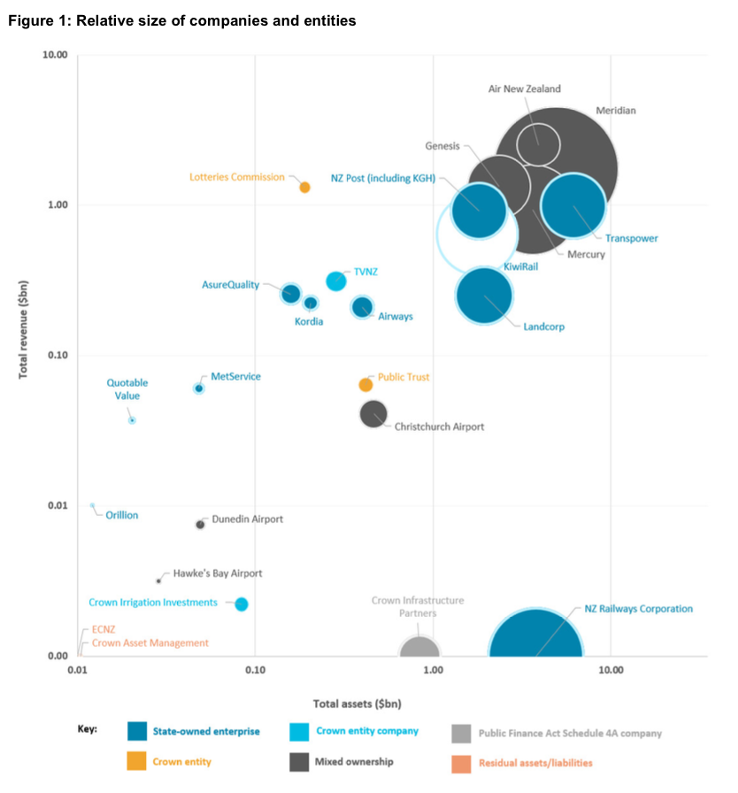

```{r setup, include=FALSE}
knitr::opts_chunk$set(echo = FALSE)
```

When New Zealand's most famous (partially) state-owned enterprise, Air New Zealand, was revealed by another (psuedo-)state-owned enterprise, TVNZ, to have been working for the Saudi military, despite Saudi involvement in the conflict in Yemen, the airline's nominal owner, the Minister of Finance, was reduced to pleading ignorance and saying it was an "operational matter". Although the "operational matter" excuse is a very common way for ministers to deflect responsibility for matters which they actually are responsible for, in this case, the Minister was probably right. State-owned enterprises were conciously structured to reduce political involvement in decision-making. This allows managers to focus on maximising long-term value for taxpayers, rather than the petty political interests of their regularly-changing ministerial masters. Generally, it is a good idea. 

However, it also reduces the pressure which the management of these firms feel to *truly* maximise value. Often managers' interests do not align perfectly with those of investors: That's why many firms use tools like stock options to align incentives. Sure, in the case of companies which are partially listed on the NZX, like Air NZ and the power companies, those private sector shareholders can pick up some of the burden of holding firms to accountable in shareholder meetings and through other activist measures, but when boards are all-but-assured of the support of their largest shareholder, this disciplining mechanism will be weak at best.

As a free-marketeer, my preferred answer to this conundrum would be simply to sell the assets and have them be entirely subject to the mercies of the market, returning the proceeds to taxpayers or paying off some debt. However, I realise this is politically inconcieveable. Even the last National government's very modest proposal to sell less than half of a subset of the assets was widely rejected by voters. They did it anyway, but the resounding referendum defeat they experienced along the way has probably cautioned future National leaders, who are unlikely to share the personal popularity of John Key, to stay away from the issue for some time. Under the current Labour government, it is even less likely.

My alternative approach then is to (at least temporarily) keep the assets in Crown ownership but subject them to much stricter market discipline. I would follow Singapore's wildly successful example and create a government-owned private equity fund to take total ownership of the assets. Let me now compare Singapore's approach to New Zealand's.

## Singapore vs New Zealand: A Case Study

Similarly to New Zealand in the 1980s, in 1974, the Singaporean government found itself in possession of a huge number of commercial assets. Singapore Airlines, Singtel (Singapore's Telecom), DBS (Singapore's largest bank), a nascent ship repair industry, hotels, and others were all being managed directly by civil servants in the Ministry of Finance and the Ministry of Trade and Industry. Singapore's ruling People's Action Party, like the New Zealand Labour Party of the 1980s, was a nominally left-leaning party which had converted to a belief in (managed) free market economics. Therefore, just as Roger Douglas and Richard Prebble did in New Zealand, they decided to convert these state-owned operations into firms managed primarily on a commercial basis. 

In both countries, many of those assets were eventually sold to private investors. For Singapore, those sales happened more gradually, because, unlike New Zealand, they didn't have an unsustainable level of private debt to pay off. But in both countries, many assets remained at least partially in state ownership. Here is where the key difference emerges.

### Residual Assets in New Zealand

New Zealand's remaining state assets were (mostly) devolved to the control of a minister called the Minister for State-Owned Enterprises. Despite the fact that this minister controls billions of dollars in assets (the true scale of these holdings can be seen on the graph below from Treasury's [latest briefing to the incoming SOE minister](https://www.beehive.govt.nz/sites/default/files/2020-12/State%20Owned%20Enterprises.PDF)), the position remains relatively low-profile. So much so that I, a massive political junkie, had to Google who it was when the Air New Zealand-Saudi controversy arose. Right now, the position is held by Dr David Clark, who is ranked number 19 out of 20 ministers in Cabinet. This low ranking and profile is primarily due to the fact that this minister exercises very little real control over the assets he nominally owns. This position is not unique to the the Sixth Labour Government: In both Labour and National governments, the position has tended to be be held either by a relatively junior minister or by a senior minister as his second or third portfolio. The Minister's principal role is to meet with and appoint the boards of these firms, who themselves don't 'run' the company, they govern it by supervising and appointing the Chief Executive Officer and other senior managers. The reality is that the "owner" of New Zealand's multi-billion dollar portfolio of Crown commercial assets is running it as a part-time job. The current minister has three other full ministerial positions which he has to juggle with it, as well as his role as constituency MP for Dunedin.




The Minister is assisted in his task by a unit of the Treasury, the Government's all-purpose economic  advisor. Among other things, Treasury is responsible for funding the government by regularly issuing Government bonds, preparing the Budget each year, assessing the quality of cost-benefit analyses made by other departments, and providing advice to the Minister of Finance, Prime Minister, and Cabinet, including on the operation of the Reserve Bank and New Zealand Super Fund. Thus, understandably, the monitoring of Crown companies is only a very small part of Treasury's work programme. In fact, [Treasury's total FY2020 budget for "Crown Company Monitoring Advice"](https://www.treasury.govt.nz/publications/estimates/vote-finance-finance-and-government-administration-sector-estimates-2020-21-html#section-8) was only \$4.7 million. To put that number into context, the FY2020 year-end net asset value of the companies monitored under that budget was more than \$30 billion^[See page 174 of the [FY2020 Financial Statements of the Government of New Zealand](https://www.treasury.govt.nz/system/files/2020-11/fsgnz-2020.pdf)]. That means the New Zealand government is paying only 0.02% per annum of its more than \$30 billion of assets under management in 'asset management fees'. By contrast, the New Zealand Superannuaton Fund incurred expenses of more than \$130 million last year in managing its \$40 billion portfolio ^[See page 127 of the [2020 Annual Report of the Guardians of New Zealand Superannuation](https://www.nzsuperfund.nz/assets/Uploads/Guardians-Annual-Report-2020.pdf)] and the Californian public pension fund paid almost US$1 billion in fees to manage its almost US\$400 billion in assets ^[See pages 56 and 99 of the [2019-20 Comprehensive Annual Financial Report of the California Public Employees’ Retirement System](https://www.calpers.ca.gov/docs/forms-publications/cafr-2020.pdf)]. Either the government is getting a bargain on the management of the SOE portfolio to the tune of 90% off, or the assets are simply not being actively managed and supervised on a commercial basis similar to that of other large pools of public money.

To check whether the Government and taxpayers are in fact getting a bargain, I submitted an Official Information Act request to the Treasury. Their (detailed, helpful, and timely) response lays out the relatively small scale of Treasury's monitoring efforts. Treasury has 15.8 full-time equivalent staff dedicated to monitoring Crown compnaies (not including managers). Roughly half of those staff have less that two years of tenure at Treasury, but most have degrees in relevant fields. In addition to the work of those employees, Treasury spent an average of $219,613.41 per year over the past five years on external professional advice related to the valuation and performance analysis of these firms. I am sure each of those civil servants does an excellent job, but the reality is that most substantial private equity firms have 10-20 full-time staff on every deal they conduct, with others directly charged with the monitoring of the portfolio. For the best returns to taxpayers to be achieved, these assets simply need more monitoring. 

The assets which belong to the Minister are not his to dispose of. Instead, any change in their ownership structure typically requires Cabinet approval and any injection of Crown money to take advantage of an investment opportunity tends to require approval in the annual Budget process. Thus, for the wholly-state-owned firms, acquisitions and expansions tend to be small and funded out of retained earnings. In theory, the Minister could request and receive Cabinet and budgetary approval to acquire a new top-level SOE, but this has not happened since the early-2000s bailouts of Air New Zealand and KiwiRail. In essence, the Crown's state asset portfolio is entirely static, barring a major policy change (like the state asset sales of the fifth National government) or a disastrous financial result in a state-owned or formerly-state-owned firm (e.g., the Air NZ and KiwiRail purchases and the bankruptcy of Solid Energy). Whatever the fundamentals of the businesses on their books, the Government approach has tended to be buy-and-hold and occasionally inject massive amounts of capital to meet policy objectives. 

### Residual Assets in Singapore

In a markedly different approach, Singapore decided to establish a new holding company to hold its newly-corporatised assets and to actively manage them on an entirely commercial basis. Essentially, they created an in-house private equity fund for taxpayer assets. This company, Temasek Holdings, is one of Singapore's three government investment vehicles and now has a portfolio with a net value in excess of NZ$300 bn, up from an initial endowment of 35 firms valued at around \$350 million. In the past 20 years, it has returned net annualised returns of 6% a year to the Singapore government -- comparable, given their different risk tolerances and investment horizons, to the NZ Super Fund's 9.63% net annualised return since 2003. 

Temasek operates as an independent owner of the assets. It is empowered to buy and sell assets as it pleases, without needing permission from the elected Government. Its only imperative is to maximise the long-term risk-adjusted return to Singaporean taxpayers. As such, it provides real market accountability to its portfolio companies. If a portfolio firm is underperforming and the fund could earn better money in an alternative investment -- like Temasek's [investment in New Zealand AI startup Soul Machines](https://www.dealstreetasia.com/stories/temasek-nz-soul-machines-169710/) -- it can offload those assets. This accountibility is reinforced by the fact that Temasek has more than 800 staff, many of whom are on performance-based contracts which link their performance to the long-term returns they generate for Singaporean taxpayers. 

Each year, the Singapore government is entitled, [under the Net Investment Returns framework](https://www.ifaq.gov.sg/mof/apps/fcd_faqmain.aspx?FAQ=116595), to draw 50% of the expected net *real* returns of its three investment vehicles, including Temasek, for use to fund expenditure. Not only does this protect the reserves against inflation, it also ensures that they grow in real terms and can contribute to a greater share of government expenditure over time, reducing the Government's reliance on tax reciepts. In special circumstances (like the Global Financial Crisis and the 2020 COVID-19 crisis), the Government can also, with permission from the President of Singapore, draw on the principal of these reserves, which it does instead of borrowing on the international debt markets^[Singapore's Government is legally prohibited from borrowing to fund expenditure].

## What New Zealand Should Do

The approaches of both Singapore and New Zealand insulate state-owned firms from political discretion. That is right and proper. If the Government wants to operate trading businesses, it should not either favour or hamstring them with regular ministerial interventions. Taxpayers deserve the assurance that their money is being managed sensibly and competitors deserve fair and equal treatment by the Government. After all, if the average minister could make decisions which reliably outperformed those of industrial leaders, he could probably make more than the $300,000 the average New Zealand minister gets paid in the private sector^[Whether he could earn more than the [NZ\$1 million salaries paid to Singaporean ministers](https://www.ifaq.gov.sg/psd/apps/fcd_faqmain.aspx?FAQ=34323) is more of an open question]. If the Government has particular non-financial interests in the operation of a certain firm or industry, it should either use legislation or regulation, with all of its requirements for transparency and scrutiny, to achieve them or strip the company of its commercial objectives altogether and run it as a standard Crown Entity. If it needs to subsidise a particular activity (like mail delivery) or manage an undesirable one (like gambling), it can do so through standard regulatory processes, like tenders and licensing requirements. Any change to the management of Crown companies must maintain this independence.

Where the approaches differ is in the economic accountability facing portfolio firms and the potential for long-term gains. Whereas an underperforming New Zealand state-owned enterprise might be recieve additional monitoring from the Treasury and, if things get really bad, a 'please explain' letter or two from the Minister, an underperforming Temasek firm might well be sold and the capital redeployed elsewhere to maximise returns for taxpayers. Even if a New Zealand minister noticed the problem and was able to organise a sale, the political pressure against it would likely be immense. The reality is that the Government income statement is sufficently large and ministerial incentives sufficently detached from performance to absorb most losses, reducing any incentive to incur those political costs. In the Temasek structure, by contrast, the nature of the organisation as an investment vehicle shields it from most such criticism and aligns the incentives of decision-makers with taxpayers. Few people wrote to the NZ Herald when the Super Fund decided to sell its \$200 million interest in the Metlifecare rest home business -- it was just a decision in the normal course of business. The same would be true of a Temasek-style manager of New Zealand's state assets. Of course, some of the assets are slightly more sensitive than a rest home chain and would thus attract more attention, but as an independent Crown agency, a New Zealand Temasek would be better insulated from immediate political pressure.

