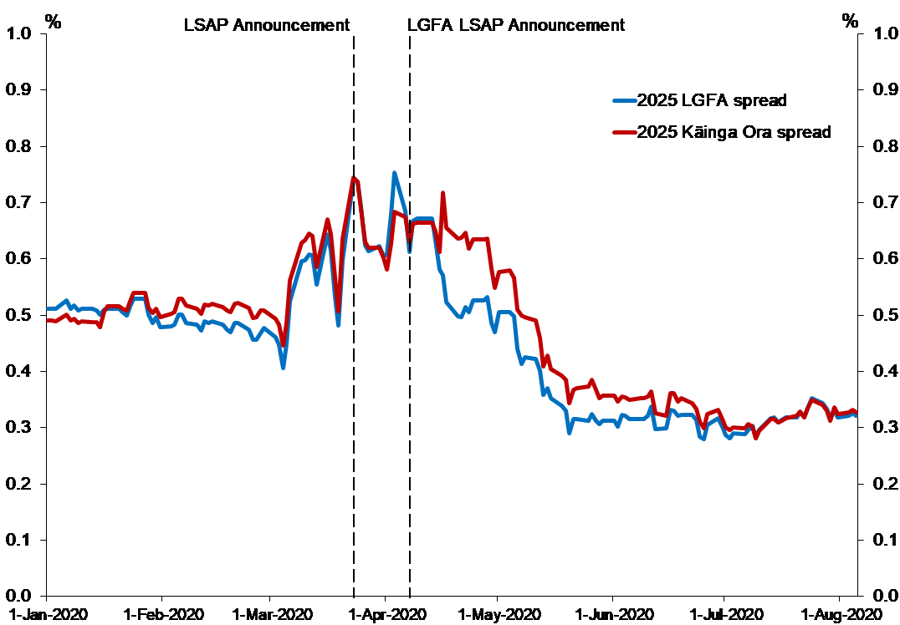
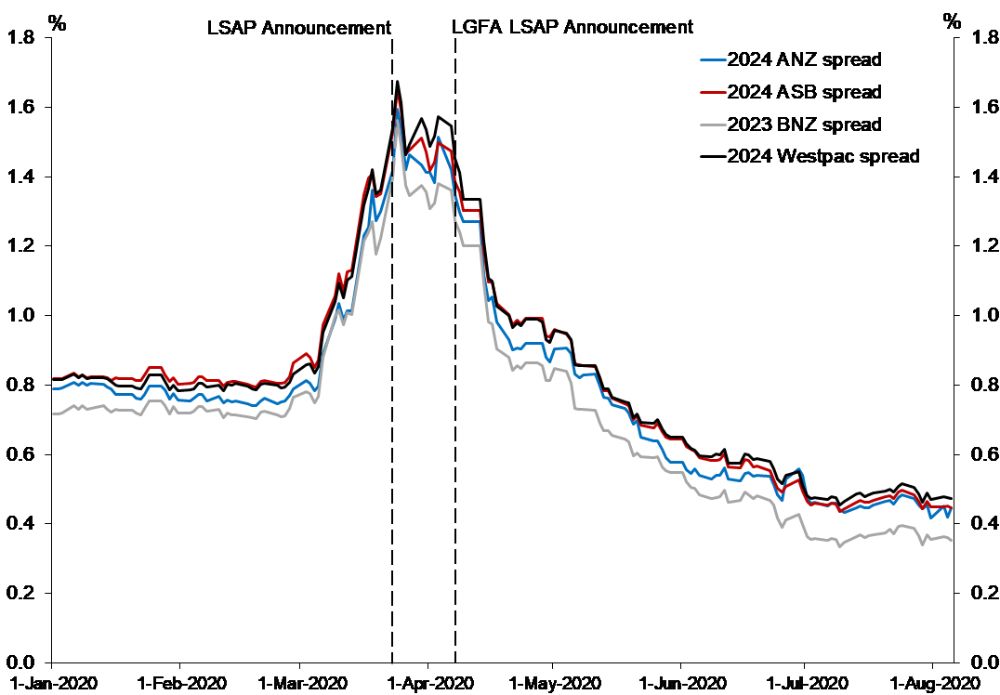

Last year, I wrote a [blog post about the weirdly low yields on residential rental property in New Zealand, compared to the yields in the United Kingdom](https://mitchellpalmer.github.io/posts/2020-11-17-is-the-government-as-safe-as-houses/). Since 1993, the premium between gross rental yields and the real yields on 10-year government bonds has averaged around 200 basis points (2 percentage points), despite the riskiness and increased cost (e.g., local government rates and property management expenses) of property investing compared to lending to the government. In the UK, the between has been (a more understandable) roughly 600 basis points (bp) over a similar period.  This leads to the obvious question: Do investors think the New Zealand government is only as safe as houses?

This odd finding (together with reading [Roger Lowenstein's book about the failure of LTCM](https://www.amazon.sg/When-Genius-Failed-Long-Term-Management/dp/0375758259)) has led me to be alert for other interesting interest rate spreads in the New Zealand capital markets.

In an [August 2020 speech to a Wellington capital markets conference](https://www.rbnz.govt.nz/research-and-publications/speeches/2020/speech2020-08-20), the Assistant Governor of the Reverse Bank, Christian Hawkesby, provided some excellent examples of seemingly out-of-kilter interest rates. He was detailing the Reserve Bank's intervention in the New Zealand credit markets in early 2020 and the resulting changes in the RBNZ balance sheet. Those interventions were in part prompted by large changes in interest rate spreads very quickly. For example, spreads between yields on government-adjacent debt issued by the Local Government Funding Agency and Kāinga Ora (the new Housing New Zealand) and debt actually issued by the Government shot up from ~50bp to 60-70bp. Similarly, spreads between Government debt and the debt issued by the big 4 Australian-owned New Zealand banks, all of which have AA- credit ratings from S&P, increased from roughly 80bp to roughly 160bp in less than a month.

Those changes are interesting, although they perhaps do represent market fundamentals about the supply and demand of funding in the market and the real risks which the COVID-19 pandemic created. Nonetheless, the RBNZ intervened and calmed them relatively quickly.

What I am most interested in is the position of these spreads beyond the immediate stress created by COVID. The LGFA and Kāinga Ora spreads are interesting for the fact there is any spread at all. Further, it is interesting that there has been significantly and persistently lower spreads between government debt and bank debt since the RBNZ intervention than there was even before the COVID stress.  The following graphs from Hawkesby's presentation show these two results:

In this post, I only focus on the first graph — i.e., the spread between yields on government bonds and Local Government Financing Agency and Kāinga Ora bonds. The change in the spread between yields on bank debt over  yields on government debt will be the topic of another post. This one is already rather long.

## Brief Outline of the Basics

Bonds (and bills, which I will treat as a subset of bonds in this post) are tradeable debt instruments. 

For the borrower, bonds are little different from a bank loan: A bond issue is made and purchasers of the bonds (lenders, aka bondholders) buy the bonds from the borrower (issuer) for a given sum. In exchange, the issuer promises to pay bondholders a series of coupon payments and a final principal repayment (the bond's face value). The value of those coupon payments is typically set in advance as a percentage of the bond's face value, just as loan repayments would be. In the event of the borrower's  default on his bond obligation, bondholders are typically entitled to receive payment out of the borrower's assets before equity shareholders, just as a bank would be in the event of a default.

However, for the lender, bonds offer significantly more flexibility than bank loans: If a bondholder decides he no longer wishes to lend to the issuer, he can sell his rights to the future coupon payments and the final principal repayment to another purchaser. A similar transaction would be possible even with a bank loan, but with bonds, a well-defined market already exists for the sale of these loans. In fact, bonds trade on an exchange similar to that on which shares do. The price at which these loans trade can be reverse-engineered^[The exact method by which yields are derived from prices and payment schedules can be found on [Wikipedia](https://en.wikipedia.org/wiki/Yield_to_maturity).] to find out the effective interest rate at which lenders are willing to lend to the issuer at the present moment. This effective interest rate is called the **yield** (to maturity, specifically).

Interest rates are shaped by two major forces: Time preference and risk. 

Time preference represents the preference that every investor has for money now over money later, even if the money later is just as certain to be received as the money now. If one has money now, one can invest that money and earn a return on it for longer than if one has money later. Moreover, given the presence of inflation, money now is likely to have a higher purchasing power than the same amount of money in the future. (Consider: Would you prefer to have \$100 in the 1970s or \$100 today?) 

The second factor is risk: Naturally, some borrowers are more likely to default than others. If you're lending to a risky borrower, you will demand that borrower compensate you for the risk that he might not pay you back in the future. If risky borrowers could borrow at the same rate as riskless borrowers, no-one would bother taking a risk by lending to the risky bets. In the context of bonds, there is also the risk that you will not be able to sell the bond if you change your mind about this borrower in the future or find a better opportunity elsewhere. This is called liquidity risk and means that bonds where millions are traded each day and the supply and demand for them are unlikely to dry up will typically trade at a lower yield than other bonds.

These two forces can be disentangled by comparing the yields on government debt to the yields on any given bond. The borrowing of governments in their own domestic currency is often considered riskless. This is for two reasons: Firstly, governments are typically considered low-risk borrowers in any currency — e.g., [the New Zealand Government is (according to S&P) a AA- rated foreign currency borrower](https://debtmanagement.treasury.govt.nz/investor-resources/credit-ratings) — because they have the ability to increase their revenue at will, by taxing the population, in order to meet repayments. Secondly, in their domestic currencies, governments can typically just 'inflate away' the debt by printing money to meet any repayments. Given this risklessness, the yield on government debt can be understood purely as a function of investors' time preference^[Whether this understanding is correct is controversial, but it forms the basis of much bond pricing]. Therefore, the 'risk premium' of a given non-governmental bond can be understood by subtracting the yield on government debt of the same duration from its yield.

## LGFA and Kāinga Ora Spreads

### The Implicit Guarantee and Default Risk

Despite their quasi-governmental nature, bonds issued by the Local Government Funding Agency and Kāinga Ora are not technically issued or guaranteed by the Crown. Rather, they are issued by, respectively, a limited-liability consortium of local governments and a central government-owned organisation with its own board. In fact, a government guarantee for LGFA is explicitly disavowed in the [Local Government Borrowing Act 2011](https://www.legislation.govt.nz/act/public/2011/0077/latest/DLM3620735.html). Similarly, Kāinga Ora, as a Crown entity, is covered by [section 49 of the Public Finance Act](https://www.legislation.govt.nz/act/public/1989/0044/latest/DLM162737.html#DLM162737), which excludes the Crown from liability for the debts of Crown entities, except those for which it has explicitly provided a guarantee. No such guarantee is provided for most KO borrowings.

In the context of that lack of a guarantee, perhaps a spread between LGFA/KO bonds and government debt is unsurprising. After all, councils, though they can compulsorily raise revenue like central government, have a debt limit, which limits their ability to borrow their way out of an inconvenient repayment. Moreover, councils cannot issue New Zealand dollars (or order the Reserve Bank to do so) with which to pay their debts. The same applies to Kāinga Ora, however, KO is doubly disadvantaged, because it cannot arbitrarily increase its own revenue through taxes; instead, it relies on government appropriations and rent payments. 

Nonetheless, though the local councils and Kāinga Ora have no government guarantee on paper, they almost certainly have one in practice — a so-called implicit guarantee. 

Consider LGFA for starters: LFGA is a mutually guaranteed organisation, where each participating council guarantees the borrowings of the overall Agency, whether those borrowings are then on-lent to that council or not. Therefore, letting LGFA default on its debt would not be the same as simply letting Wellington City Council default, for instance. If LGFA fails, every council would become a less-creditworthy borrower. That would drive up borrowing costs and, therefore, council rates across the country. It might also lead to the cancellation or postponement of critical infrastructure projects. That kind of outcome would be politically unacceptable for all but the most financially orthodox government. Moreover, there is [pre-existing legislative authority](https://www.legislation.govt.nz/act/public/2011/0077/latest/DLM3620734.html) for the Minister of Finance to lend to the LGFA in extraordinary circumstances, meaning the government would face no need to justify itself to Parliament and could get funding to the LGFA very quickly to avert a default. These factors have led to Standard and Poors, one of the two largest credit-rating agencies, judging there to be an ["extremely high likelihood"](https://www.lgfa.co.nz/files/documents/New%20Zealand%20Local%20Government%20Funding%20Agency%20Ltd.%20Ratings%20Raised%20After%20Similar%20Action%20On%20New%20Zealand%3B%20Outlook%20Stable.PDF) that the government would bail out LGFA in the event of financial stress. As a result, they give the LGFA the same credit rating as the Crown. This implicit guarantee is in fact advertised by LGFA, who in their press statement lauding the upgrade of their credit rating by S&P, make particular mention of ["the view by S&P Global Ratings that there is an extremely high likelihood the New Zealand government would provide LGFA with extraordinary support in a stress scenario, if needed"](https://www.lgfa.co.nz/about-lgfa/lgfa-news/lgfa-credit-ratings-raised-by-s-p-global-ratings-to-aa-aaa).

Much the same story applies to Kāinga Ora. The provision of public housing is a cornerstone of the Government's social services policy. If the public housing provider were to default, that would threaten the sustainability of this policy and possibly open the State's housing assets up to disposal in bankruptcy proceedings. This result would be deeply politically embarrassing, not to mention possibly disastrous for the subsidised tenants of such properties.  Moreover, the Government has it well within its power to prevent such a default, given it provides 90% of Kāinga Ora's revenue and could, under the emergency powers granted to it by the Public Finance Act, inject capital as required to shore up the organisation. These factors together allowed the credit agency Moody's to report — and Kāinga Ora to advertise — that ["there is no meaningful distinction between Kāinga Ora, HNZL and the Crown from a credit perspective"](https://kaingaora.govt.nz/assets/Investors-Centre/investor_presentation_.pdf).

Finally, such implicit guarantees partially exist because the market believes they do. Such a belief is, to some extent, a self-fulfilling prophecy. If the Government were not to live up to such a perceived implicit guarantee, the market would question why. If the market came to the conclusion that the Government did not provide the backing because it does not believe itself to be in a sustainable enough financial position to do so, bond buyers might believe the government to a risky borrower in itself. They could therefore drive up yields on government debt and/or refuse to lend to the Crown. That would be disastrous for the Government's own ability to finance its operations and the mere possibility of it occurring might prompt the Government to bail out an organisation just to demonstrate confidence in its own ability to do so. Furthermore, even if the market believed that the Government was *able* to bail out the organisation and was simply choosing not to, that could have disastrous implications elsewhere. Now, every implicit government guarantee — whether to local councils, Crown Entities, or even commercial banks previously believed to be 'Too Big To Fail'^[The Government's proposed permanent deposit guarantee scheme, which provides an explicit government guarantee to bank depositors, might prevent the banks from becoming intertwined in such a mess. Nonetheless, the system does not yet exist.] — would be thrown into question: If the government won't bail out *x*, who else won't they bail out? That would drive up yields and possibly cut off debt funding to many critical organisations, which themselves provide funding to other organisations, possibly leading to a systemic breakdown in the capital markets and a credit crunch. At worst, it could lead to a run on the retail banks. No Government would want such an outcome and might provide the guarantee to the organisation they did not wish to guarantee simply to prevent it. Moreover, even if the Government did not intervene, the Reserve Bank might, under its mandate to protect financial stability. Even if such a systemic breakdown did not occur, some organisations would almost certainly come under severe fiscal threat. If those other organisations did in fact turn out to have an implicit guarantee, the Government would feel be obliged to support them. If such a second-order bail out was viewed as more expensive (politically or economically) than simply bailing out the root cause of the issue, the Government could end up bailing out the initial organisation in the end, despite their initial reticence. 

The implications of such an implicit guarantee are clear. If investors believe that the guarantee is watertight, they should — all else being equal — believe the Government and these quasi-governmental organisations to be equally solid creditors. Therefore, they should be willing to lend to both on the same terms and no spread should exist between the yields on government and quasi-governmental bonds.

However, of course, there remains some uncertainty about this implicit guarantee, no matter how certain I, S&P, and Moody's are that one exists. For instance, the Government might prevent a total default, but require bondholders to take a haircut. Or, perhaps, a Minister of Finance braver than I could simply refuse to offer such a guarantee, believing that reinforcing the perception of such a guarantee would lead to unacceptable levels of moral hazard. That uncertainty, in itself, might justify some minor risk premium being charged over Government debt.

### The Liquidity Premium

Nonetheless, the confidence of S&P and Moody's — both of which shape market opinion significantly — leads me to believe that default risk is not the major driver of the spread between government yields and those on these quasi-government organisations. As I said above, all else being equal, a government guarantee on a given bond should lead to that bond being traded at the same rates as government debt. However, all else is not equal between these two types of debt and government debt: New Zealand government debt may well be considered to be more liquid (i.e., easier to exchange for cash).

As at the [May 2021 KO investor update](https://kaingaora.govt.nz/assets/Investors-Centre/investor_presentation_.pdf), there was \$5.35 billion of KO marketable debt on issue. The largest fungible segment^[By fungible segment, I mean bonds which are interchangeable with each other, i.e., of the same class and maturity] of that debt was due for redemption in June 2025 and had \$1.33 billion of debt on issue. Similarly, the [LGFA May 2021 update](https://www.lgfa.co.nz/sites/lgfa.co.nz/files/25.05.2021%20Investor%20Presentation.pdf) records \$13.5 billion in retail bonds issued, with \$1.76 billion in the largest maturity, due in April 2023. Those are large absolute figures — after all, Kāinga Ora's debt of \$5.35 billion is roughly \$1000 per New Zealander — but they are not relative to the broader market for sovereign-like debt. According to the [NZ Debt Management Office](https://debtmanagement.treasury.govt.nz/funding-strategy), as at the end of May 2021, the Crown had more than \$16 billion in debt on issue in a single maturity (the April 2023 maturity) and almost \$127 billion in overall marketable debt on issue.

A much larger pool of debt on issue suggests that a deeper market exists for Government debt than for quasi-government debt. That means, as an investor, you might be more confident of the existence of a purchaser at the market price when you want to dispose of a government security than a KO or LGFA security. That guarantee of liquidity might make investors more willing to hold government debt than quasi-governmental debt, driving up the yield they require to hold quasi-governmental debt and explaining some of the spread between the two categories.

Nonetheless, I question the magnitude of this liquidity difference. 

Firstly, all three types of debt we're talking about are eligible for the [Reserve Bank's overnight reverse repo facility](https://www.rbnz.govt.nz/-/media/reservebank/files/publications/bulletins/2012/2012dec75-4cook.pdf). This facility allows counterparties to swap their bonds for cash from the RBNZ on an overnight basis, in order to meet immediate cash needs. The amount of cash the RBNZ provides to the counterparties is equal to the price of the security minus a haircut. Then, the counterparties purchase the security back at the market price plus an interest allowance the next day. The opposite transaction is also possible, wherein the RBNZ sells the security to the counterparty and repurchases it later, in essence, lending the counterparty a bond and accepting a deposit from them. Both KO and LGFA bonds are subject to a larger 'haircut' than New Zealand government bonds, but this small difference will have only a marginal impact on the actual liquidity available for any given quantity of bonds. The Reserve Bank, therefore, acts as a lender of last resort, ensuring that even if a bondholder cannot sell their security, they can at least exchange it for cash to meet short-run cash needs.

Secondly, both LGFA and central government bonds are also eligible for [other RBNZ purchase programmes](https://www.rbnz.govt.nz/markets-and-payments/domestic-markets/facilities-at-a-glance), which are intended to either enhance market functioning or implement monetary policy and should assure investors of the liquidity of the securities. These programmes include the *Bond Market Liquidity Support* facilities (where small quantities of bonds are purchased with existing cash) and the *Large Scale Asset Purchases* programme (where large numbers of bonds are purchased with new cash). The RBNZ is permitted to purchase up to 30% of LGFA bonds on issue under the LSAP programme, while it can purchase as many bonds as its balance sheet will allow under the BMLS facility. Those two facilities together surely provide as much assurance as can reasonably be given of a liquid-enough market in the LGFA bond market. Nonetheless, their impact must be limited — after all, KO bonds are not similarly eligible to these facilities (although perhaps participants believe they would become so in any liquidity crisis) and trade at the same premium to government bonds as do LGFA bonds.

This guaranteed liquidity from the RBNZ would suggest most of the premium in the yields of quasi-government debt cannot be explained by differences in liquidity. What remains then as an explanation for the stubborn spread between these two asset classes?

### Others Sources of Pricing Discrepancies

If the difference between two bond prices cannot be sufficiently explained by the differences in risk (whether the risk is of default or illiquidity) between them, the next place to look is naturally the demand side. Is there a structural reason, other than risk, why lenders would prefer to lend to one borrower than another? In this case, the answer is yes and the reason is bank capital requirements.

Most readers will be familiar with the nature of regulated fractional reserve banking, but this is a quick introduction to the relevant factors at play here: 

First, banks take deposits from their clients. Banks can also borrow money like any other corporation, for instance, by issuing bonds or borrowing from another bank. These deposits and borrowings are liabilities on the bank's balance sheet: Depositors have effectively lent their money to the bank. 

Banks then take this borrowed money and lend it out — for instance, by writing mortgages or buying the bonds of large corporations or governments. These loans then become assets of the bank. However, banks must make allowances for two risks: Firstly, their depositors (and other lenders, depending on the structure of those loans) might want their money back before the loans are paid off. Secondly, the loans might not actually be paid back — borrowers might default. Therefore, to protect depositors, banks are not permitted to lend out the entirety of their borrowed money. 

For every loan they write, banks are required to hold a proportional percentage of the loan value as 'capital' in highly liquid and safe assets — best of all cash or deposits in their accounts at the Reserve Bank — to allow for those two risks. The percentage of capital required falls with the liquidity and safety of the loan, as both are perceived by the regulator: If a loan is highly liquid, then the bank can simply call it in or sell it (depending on the contractual arrangement) if their depositors demand their funds back. Similarly, if the loan is very safe, the risk of the bank losing large amounts of money and being unable to pay their depositors back is low.

Naturally, banks prefer to loan out as much of their deposits as possible, because the more loans they make, the more interest they collect. Therefore, if all else (including the risk and liquidity that the bank perceive) is equal, the bank will prefer to write loans for which is required to hold a lower capital allowance. Therefore, the capital treatment of a given  class of loan by the regulator can be an important determinant of demand for that loan.

In this case, the Reserve Bank — which is the primary regulator of banks in New Zealand — has set different capital requirements for government bonds and for bonds issued by LGFA and Kāinga Ora^[N.b., this analysis is based on the [Reserve Bank's Capital Adequacy Framework (standardised approach) document](https://www.rbnz.govt.nz/-/media/ReserveBank/Files/regulation-and-supervision/banks/banking-supervision-handbook/BS2A-capital-adequacy-framework-standardised-approach-oct-2015.pdf?la=en&revision=d46a19cb-5645-43b8-810f-9859e2da437d). In reality, most of New Zealand's largest banks are regulated under the 'Internal Model-Based Approach'. This approach does not, however, substantially differ in the relevant respects from the standardised approach.]. Bonds issued by the Crown directly are considered as loans to a sovereign and moreover, because the sovereign is New Zealand, are subject to a 0% risk weight — meaning no additional capital is required to back them. However, bonds issued by Crown Entities, like Kāinga Ora, whatever their implicit default or liquidity guarantee, are considered to be loans to a corporate ^[See sections 34(1)-34(2) and 43(b) of the Capital Adequacy Framework] and subject to a 20% risk weight, based on their AAA domestic currency credit rating. Similarly, bonds issued by the Local Government Funding Agency, which is considered a local authority under the Local Government Act, and other local authorities are considered "claims on public sector entities" ^[See sections 29 and 43(d) of the framework] and subject to a 20% risk weight, based on their domestic currency rating. Similar capital adequacy rules likely apply for banks in other jurisdictions (e.g., Australia) who might hold New Zealand governmental or quasi-governmental debt on their books. They also likely apply to insurance companies, which are also regulated by the Reserve Bank and are also required to meet capital adequacy requirements. Moreover, regulatory rules which limit the investments of 'cash' KiwiSavers and other conservatively-oriented investment funds often distinguish between sovereign and non-sovereign risks and limit exposure to non-sovereigns like LGFA and Kāinga Ora, despite their credit ratings being identical to those of the Government.

Banks (and insurance companies and other highly-regulated investors) are some of the largest holders of low-risk securities like government bonds. They allow them to earn (admittedly low) returns on their reserves, without running afoul of regulators. In New Zealand, for instance, the registered banks held ~18% of government bonds on issue as [at the end of April 2021](https://www.rbnz.govt.nz/statistics/d30). This regulation-created demand necessarily drives up the prices of government bonds on issue and, mechanically, drives down their yields. If quasi-governmental bonds, even those rated by international credit agencies as just as riskless as their respective sovereign bonds, are not considered equivalent for regulatory purposes, they will necessarily not be so in demand. As such, their prices will be lower and their yields higher, all else being equal, than the equivalent government bond.

An alternative formulation of that phenomenon is this: Imagine you are a bank treasurer, tasked with investing the Bank's surplus capital. You could choose a sovereign bond, which would incur no regulatory charge, or you could choose a quasi-governmental bond, like one issued by Kāinga Ora or the LGFA, which would count against your bank's risk allowance, reducing your bank's ability to take profitable risks elsewhere in its portfolio. You, like the credit rating agencies, believe the quasi-governmental bond to be just (or almost) as safe as the sovereign bond.  Whatever your own judgement, however, you would have to receive a higher yield than you would on the sovereign bond to prefer the quasi-governmental bond. The alternative to investing in the quasi-government bond is *not* investing in an equivalently risky security — like a government security. The alternative is to invest in a security which the central bank *considers* as equivalently risky — i.e., corporate bonds with a high credit rating. Therefore, the yield on these quasi-governmental bonds becomes significantly higher than perhaps their fundamentals would suggest.

## Conclusion

The overall difference between quasi-governmental and government bond yields appears, therefore, to be the sum of:

1. A premium for the (very low) likelihood that, in the event of the default of Kāinga Ora or LGFA, the Government would not bail them out.
2. A premium for the lower liquidity of LGFA and Kāinga Ora bonds, especially once one excludes the liquidity support provided by the Reserve Bank.
3. A premium for the unfavourable regulatory treatment received by the LGFA/KO bonds relative to bonds issued directly by the Government, for the purposes of bank capital adequacy.

There may be more reasons, but these are the ones which occurred to me.

This post is most certainly not investment advice. In fact, betting against this 'mispricing' could well be a mistake — after all,  all three of these reasons for a spread are reasonable in themselves and substituting your own judgement about the appropriate default risk, liquidity risk, and regulatory preference premiums for a given class of securities for that of the market is a risky manoeuvre.

Nonetheless, this finding does have interesting implications for public policy. 

Firstly, it suggests that the government should probably make its guarantees for different classes of quasi-governmental debt explicit, if they do indeed exist. Doing so could well reduce the yields on these bonds and, therefore, the borrowing costs of the government overall.  If, however, such a guarantee does not exist or is purely discretionary, the government should also probably make this explicit and order quasi-governmental entities to stop (quasi-)advertising such guarantees. If it doesn't do so, it is depriving savers of legitimate yields which they deserve for the risks they are taking, while still subjecting them to those risks. Moreover, it is encouraging these quasi-governmental entities to borrow more than they rationally should, by artificially reducing their costs of borrowing. Even without a guarantee, this increases the risk to the Crown balance sheet by making a default more likely.

Secondly, it suggests that the RBNZ's system of liquidity guarantees might have unforeseen implications for the asset allocations of lenders. By artificially reducing the liquidity risks (which are inherent in a small, shallow capital market like New Zealand's) of certain classes of security, RBNZ might be directing investment into those classes, at the expense of riskier and less liquid assets like corporate bonds.

Thirdly, it highlights the unusual distortions introduced by RBNZ's capital adequacy framework for banks. Rather than simply relying on the judgements of ratings agencies (which are admittedly very fallible; see their ratings of mortgage-backed securities before the GFC), the RBNZ/Basel framework superimposes central bank views of risk on top of these credit ratings. This results in oddities where two equivalent rated securities (Kāinga Ora and government bonds, for instance) have two different risk weights. It is unclear whether these differences in treatment are entirely intentional or rational.  