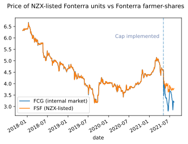
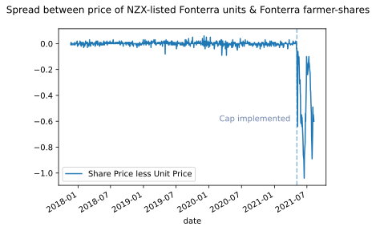

*This piece discusses the price of securities on the New Zealand Stock Exchange and other markets operated by the NZX. However, it is not investment advice and should not be relied upon as such.*

In finance classes, we spend a lot of time on **arbitrage**. An arbitrage is a trade where you profit off the difference in prices between two equivalent financial assets (e.g., stocks, bonds, options, currencies, or commodities). The logic is simple: Who would spend \$10 to get a series of cashflows (which is what most financial assets are) which you could get for \$9? No-one. Thus, equivalent assets should have equivalent prices and, if you can bet on the gap of prices between equivalent assets narrowing, you can make money without risk. Unfortunately for would-be arbitrageurs, most arbitrages are for tenths of a cent and last for only tenths of a second. However, recent changes in the market for shares and units in Fonterra -- the New Zealand dairy exporter -- provide an excellent example of how arbitrage can work -- and fail. That's what I cover in this post.

New Zealand readers will be familiar with Fonterra. For overseas readers, here's a brief introduction: Fonterra is New Zealand's largest company (by some metrics) and is responsibile for the vast majority (roughly 80%) of our dairy exports, which, because of New Zealand's outsized role in the global dairy industry, means they are also responsible for a very large portion (around 30%) of global milk exports. Fonterra is a co-operative, meaning the dairy farmers which produce the raw milk which Fonterra converts into saleable products (like milk, cheese, milk powder, and ice cream) own the firm. 

Before the Trading Among Farmers (TAF) system was introduced in 2010, the number of shares which each farmer was allowed/required to hold was equal to the amount of milk solids they sold to Fonterra. If they wished to sell more milk solids than they held shares, they had to purchase more shares from Fonterra. If they did not sell as many kilograms of milk solids as they held shares, they had to sell (redeem) their shares to Fonterra. This made Fonterra vulnerable: Its capital could leave at any moment -- and, most likely, would leave at just the moment when Fonterra, starved of milk solids to sell, could least afford for it do so.

Under TAF, these rules were relaxed and the system was fundamentally reformed. Farmers are still subject to minimum and maximum shareholdings as a function of their milk production, but the amount is a wider band. Moreover, they no longer need to buy from/sell to Fonterra -- they can trade shares **among** farmers on a kind of internal stock exchange. This gives Fonterra more certainty in its capital because it isn't on the hook for redemptions.

As part of TAF, Fonterra also established a new entity -- the Fonterra Shareholders' Fund -- to own part of the co-operative. The FSF's job is to convert (internal) **shares** of Fonterra, which due to the co-operative nature of the firm, cannot be traded with non-farmers, into (external) **units** which can be. Though these units do not have the voting rights of ordinary shares, they do have the economic rights, including the right to receive a dividend from Fonterra, as if they were ordinary shares. These units trade on the New Zealand (NZX) and Australian (ASX) Stock Exchanges. Farmers (and only farmers^[There is one exception. That is Craigs Investment Partners, the market maker. Craigs is the only non-farmer allowed to transact on both the internal and external Fonterra markets. Their role is to ensure that farmers who wish to purchase shares can always find a willing seller and vice versa.]) have the right to (within the limits imposed by Fonterra's minimum and maximum shareholding rules) trade units for shares on a one-to-one basis and *vice versa*. So, for instance, a farmer could swap his shares in Fonterra for FSF units and immediately sell those FSF units on the NZX to a non-farmer. A few weeks later, another farmer could buy those same FSF units on the NZX from a member of the public and then swap them back for Fonterra shares. In the interim, the Fonterra shares in question sit on the balance sheet of the FSF and any dividends which are paid go to the member of the public who holds the units.

This should create a very strong linkage between the two markets. If you are a farmer (or the market maker) and you see that you can **buy** units on the NZX at a lower price than you can **sell** shares on the internal Fonterra share market, you can make riskless money by buying the units on the NZX, redeeming them for the shares, and then selling the shares on the internal market. In doing this transaction, you'll be lowering the supply of units on the NZX, driving up their price, and increasing the supply of shares on the internal market, driving down theirs. Eventually, enough shares will be traded in this direction that the prices will end up basically equal. The opposite logic applies if the units are more expensive than the shares -- but with the same result: In the end, the shares and units in Fonterra ought to trade at very close to the same price.

At least, all of that **was** true. Recently, Fonterra decided to review its capital structure. The co-op may wish to wind up the Shareholders' Fund and return all ownership of the firm to farmers. If they do so, they would require the approval of unitholders in the Shareholders' Fund and would likely have to purchase back their units at a premium to the market price. In order (presumably) to stop the cost of that buy-back blowing out, Fonterra has exercised its right under the various contracts and deeds which underpin this arrangement to cap the size of the FSF. That means farmers cannot exercise their option to convert their internal shares into units (because doing so would expand the assets of the FSF).

That has destroyed the tight linkage which ought to exist between the two markets. If farmers notice that the price of shares on the internal market is lower than on the external market, they can no longer swap one for the other and force the prices back together (and make money while doing so).

This can be very starkly seen on the following two graphs: Until the capping of the FSF, the two prices moved in almost perfect lockstep -- in much of the graph you cannot even see the internal market line because of how closely it tracks the public market price.

Now, I have plotted the difference between the two prices. As you can see, the difference was very close to 0 for almost the entire trading period for which we have data. But as soon as the redemption linkage was severed, the relative price of the internal market collapsed, because no arbitrage mechanism existed to keep the two prices in line with each other.

Farmer-shareholders in Fonterra are, due to the cap on FSF growth, essentially having to leave money on the table. The price differential shows clearly that public investors value marginal exposure to Fonterra more than their fellow farmer-shareholders, but -- due to the change in institutional structure -- they are no longer able to satisfy that demand and convert that difference into cash. Instead, they can only trade with their fellow farmer-shareholders.

**Acknowledgements: ** Data is from the NZX website.

